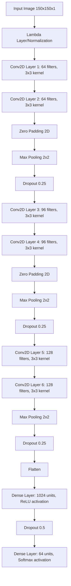

# Signature Verification System

This repository contains the implementation of a comparative analysis of different feature extraction methods for signature verification as described in the paper: "Comparative Analysis of Feature Extraction Methods for Signature Verification".

## Overview

This project compares three distinct approaches to signature verification:
1. **CNN (Convolutional Neural Network)** for end-to-end feature learning
2. **HOG (Histogram of Oriented Gradients)** with SVM (Support Vector Machine) classifiers
3. **SIFT (Scale-Invariant Feature Transform)** descriptors with SVM classifiers

The methods are evaluated on their ability to correctly identify and verify signatures across a variety of metrics including accuracy, precision, recall, and F1-score.

## Project Structure

- `main.ipynb`: The main Jupyter notebook containing all the implementation code
- `Comparative Analysis of Feature Extraction Methods for Signature Verification.pdf`: The detailed report on the methodology and findings
- `images/`: Directory containing visualization outputs
  - `model_comparison.png`: Performance comparison chart
  - `cnn_confusion_matrix.png`: Confusion matrix for CNN model
  - `hog_confusion_matrix.png`: Confusion matrix for HOG-SVM model
  - `sift_confusion_matrix.png`: Confusion matrix for SIFT-SVM model

## Dataset

The implementation uses the Signature Verification Dataset from Kaggle, containing genuine and forged signatures from multiple individuals. The dataset organization follows a structure where each signer has:
- A folder containing genuine signatures
- A corresponding folder with forged signatures (denoted by the suffix "_forg")

## CNN Architecture

The CNN model implements a deep architecture designed specifically for signature verification:



### CNN Model Details:
- **Input Preprocessing**:
  - Grayscale conversion
  - Resizing to 150×150 pixels
  - Normalization to [0,1]
  
- **Training Parameters**:
  - Optimizer: AdamW with learning rate of 0.0001
  - Weight decay: 1e-5
  - Loss function: Categorical cross-entropy
  - Early stopping based on validation loss

## HOG-SVM Implementation

HOG (Histogram of Oriented Gradients) features are extracted with the following parameters:
- Window size: 150×150 pixels
- Cell size: 8×8 pixels
- Block size: 16×16 pixels (2×2 cells)
- Block stride: 8×8 pixels (50% overlap)
- Number of orientation bins: 9

These HOG features are used to train an SVM classifier with a radial basis function (RBF) kernel.

## SIFT-SVM Implementation

The SIFT-based approach follows these steps:
1. Detect SIFT keypoints and compute descriptors for each image
2. Compute the mean of all descriptors for each image to create a fixed-length feature vector
3. Train an SVM classifier with an RBF kernel using these feature vectors

## Results Summary

| Model     | Accuracy | Precision | Recall  | F1-Score |
|-----------|----------|-----------|---------|----------|
| CNN       | 77.58%   | 80.57%    | 77.58%  | 77.25%   |
| HOG-SVM   | 87.88%   | 90.52%    | 87.88%  | 87.43%   |
| SIFT-SVM  | 24.85%   | 17.62%    | 24.85%  | 16.26%   |

The HOG-SVM approach outperforms both the CNN and SIFT-SVM approaches across all metrics, highlighting the effectiveness of traditional feature engineering techniques when combined with appropriate classifiers for signature verification tasks, particularly when training data is limited.

## Project Repository

The full implementation is available at: [https://github.com/Ibzie/Signature-Identification-using-CNNs-HOG-SVMs](https://github.com/Ibzie/Signature-Identification-using-CNNs-HOG-SVMs)

## Usage

1. Clone the repository:
```bash
git clone https://github.com/Ibzie/Signature-Identification-using-CNNs-HOG-SVMs.git
cd Signature-Identification-using-CNNs-HOG-SVMs
```

2. Install the required dependencies:
```bash
pip install tensorflow opencv-python scikit-learn scikit-image matplotlib numpy pandas
```

3. Download the Signature Verification Dataset from [Kaggle](https://www.kaggle.com/datasets/robinreni/signature-verification-dataset) and place it in the `CNN/Data` directory:
```
CNN/
└── Data/
    ├──test_data.csv
    ├──train_data.csv
    ├── test/
    │   ├── 001/
    │   ├── 002/
    │   └── ...
    └── train/
        ├── 001_forg/
        ├── 002_forg/
        └── ...
```

4. Open `main.ipynb` in Jupyter Notebook or JupyterLab:
```bash
jupyter notebook main.ipynb
```

5. Run the cells in sequence to:
   - Load and preprocess the signature dataset
   - Train and evaluate the CNN model
   - Extract HOG features and train SVM classifier
   - Extract SIFT features and train SVM classifier
   - Compare and visualize the results
